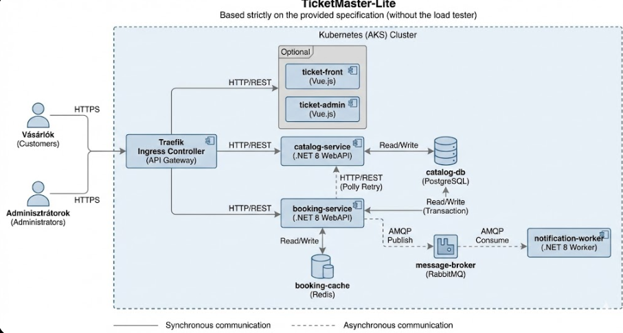

# Skálázható szoftverek - Nagy házi feladat

## Követelmény specifikáció

Egy online jegyértékesítő rendszert  megvalósítok meg, amely lehetővé teszi a látogatók számára, hogy  események között böngésszenek, valamint jegyeket vásároljanak. Az adminisztrátorok számára biztosítani kell az események és a készletek kezelését.

### Funkcionális követelmények:
* **A vásárlók/adminisztrátorok** bejelentkezhetnek a rendszerbe (JWT alapú azonosítás) és csak bejelentkezve végezhetnek műveleteket.
* **A vásárlók/adminisztrátorok** böngészhetnek az elérhető események (koncertek) listájában.
* **A vásárlók/adminisztrátorok** megtekinthetik egy adott esemény részleteit (időpont, helyszín, ár).
* **A vásárlók/adminisztrátorok** jegyeket foglalhatnak a kiválasztott eseményre.
* **A rendszer** kezeli a készletet, megakadályozva a túlfoglalást.
* **A rendszer** sikeres foglalás esetén aszinkron módon értesítést (szimulált email) küld a felhasználónak.
* **Az adminisztrátorok** új eseményeket hozhatnak létre és módosíthatják a meglévőket.

## Architektúra és technológiák

### Architektúrális alapelvek
A szolgáltatások **konténerizált mikroszolgáltatásokként** lesznek megvalósítva. A fejlesztői környezet Docker Compose alapú, Kubernetes (AKS) környezetben,az éles környezet pedig Azure Kubernetes Service (AKS), ahová Helm chart segítségével történik a telepítés.

**Szolgáltatások  elve:**
A komponensekre bontás az **üzleti funkciók** szétválasztásán alapul:
1.    **Auth:** Felhasználók kezelése, belépés, JWT token generálás.
2.  **Catalog:** Az események adatainak kezelése (böngészés, adminisztráció,módosítás).
3.  **Booking:** A jegyvásárlási folyamat és a tranzakciók kezelése.
4.  **Notification:** Az értesítések kiküldése aszinkron módon, háttérfolyamatként.
5.  **Analytics:** Vásárlási statisztikák mentése.

**Technológia választás indoklása:**
* **.NET 8:** Modern keretrendszer mikroszolgáltatásokhoz.
* **PostgreSQL:** Relációs adatbázis a strukturált adatok (események) megbízható tárolására. 
* **Redis:** In-memory kulcs-érték tár a foglalások gyors kezeléséhez és készletnyilvántartáshoz. 
* **RabbitMQ & MassTransit:** Aszinkron, üzenetsor alapú kommunikáció a szolgáltatások laza csatolásához. 
* **MongoDB:** Dokumentum alapú NoSQL adatbázis az analitikai adatok rugalmas tárolására. 
* **Traefik:** Ingress Controller / API Gateway a bejövő forgalom routingolásához.
* **MongoDB**Dokumentum alapú NoSQL adatbázis az analitikai adatok rugalmas tárolására.
* **Helm**Csomagkezelő a Kubernetes erőforrások (Deployment, Service, Ingress) egységes telepítéséhez.

### Komponensek listája

A rendszer elemei, rövid leírása és a választott technológiák:

| Szolgáltatás | Technológia | Leírás |
| :--- | :--- | :--- |
| **auth-service** | .NET 8 WebAPI |Felhasználókezelés, JWT token kiállítása. Postgres adatbázist használ. |
| **catalog-service** | .NET 8 WebAPI | Események kezelése és listázása. Saját adatbázist (PostgreSQL) használ. REST API-t nyújt. |
| **booking-service** | .NET 8 WebAPI | Jegyvásárlás kezelése. A készletet Redisben kezeli, tranzakciót Postgresben, majd eseményt publikál (MassTransit). 
| **notification-worker** | .NET 8 Worker | Háttérszolgáltatás, amely feliratkozik (MassTransit) a foglalási eseményekre, és szimulálja az értesítést. |
| **analytics-service** | .NET 8 Worker | Háttérszolgáltatás, amely feliratkozik a vásárlási eseményekre, és MongoDB-be menti azokat. |
| **ticketmaster-db** | PostgreSQL | Közös relációs adatbázis konténer a mikroszolgáltatások pl Catalog, Booking számára. |
| **ticketmaster-redis** | Redis | Elosztott cache konténer a foglalások gyors kezeléséhez és a készletnyilvántartáshoz. |
| **ticketmaster-mongo** | MongoDB |Dokumentum alapú adatbázis konténer az Analytics Service számára.|
| **my-rabbitmq** |	RabbitMQ|	Üzenetsor bróker a szolgáltatások közötti aszinkron kommunikációhoz.
| **API Gateway** | Traefik | Belépési pont és routing (`/api/catalog`, `/api/booking`). |
### Logikai architektúra ábra

A komponensek közötti kapcsolatok, az adatfolyam és a telepítési környezet (Azure) az alábbi ábrán látható:

