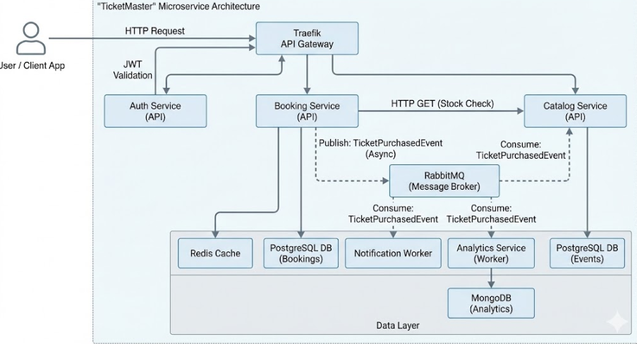

# Scalable Software

## Requirement Specification

I am implementing an online ticket sales system that allows visitors to browse events and purchase tickets. For administrators, management of events and inventory must be provided.

### Functional requirements:
* **Customers/administrators** can log in to the system (JWT-based identification) and can only perform operations while logged in.
* **Customers/administrators, anyone in Docker, and anyone else** can browse the list of available events (concerts).
* **Customers/administrators, anyone in Docker, and anyone else** can view the details of a specific event (time, location, price).
* **Customers/administrators** can book tickets for the selected event.
* **The system** manages the inventory, preventing overbooking.
* **The system**, in case of a successful booking, sends a notification (simulated email) asynchronously to the user.
* **Administrators** can create new events and modify existing ones.

## Architecture and technologies

### Key Technical Achievements & Cloud-Native Practices
* **Cloud Orchestration:** Deployed the microservices architecture on **Azure Kubernetes Service (AKS)**, ensuring high availability and scalability.
* **Infrastructure as Code (IaC):** Utilized **Helm charts** for standardized and repeatable Kubernetes deployments across different environments.
* **Container Registry:** Managed Docker images using **Azure Container Registry (ACR)** with automated build pipelines (`az acr build`).
* **Advanced Kubernetes Features:** Implemented Kubernetes **ConfigMaps** for dynamic configuration and **Secrets** for secure credential management.
* **API Gateway & Security:** Configured **Traefik Ingress Controller** for routing and implemented **ForwardAuth middleware** to offload JWT validation to the API Gateway level.
* **Event-Driven Architecture:** Integrated **RabbitMQ** via **MassTransit** for reliable, asynchronous inter-service communication (Pub/Sub pattern).
* **Resiliency & Performance:** Implemented distributed caching using **Redis** and utilized **Polly** for fault-tolerant HTTP policies (retries and circuit breakers).
* **Polyglot Persistence:** Successfully managed multiple database engines within the cluster, including **PostgreSQL** for relational data and **MongoDB** for flexible analytics storage.

### Architectural principles
The services will be implemented as **containerized microservices**. The development environment is based on Docker Compose, and the production environment is Azure Kubernetes Service (AKS), where deployment is carried out using a Helm chart.

**Service principle:**
The decomposition into components is based on the separation of **business functions**:
1. **Auth:** User management, login, JWT token generation.
2. **Catalog:** Management of event data (browsing, administration, modification).
3. **Booking:** Management of the ticket purchasing process and transactions.
4. **Notification:** Sending notifications asynchronously, as a background process.
5. **Analytics:** Saving purchase statistics.

**Justification for technology choice:**
* **.NET 8:** Modern framework for microservices.
* **PostgreSQL:** Relational database for the reliable storage of structured data (events).
* **Redis:** In-memory key-value store for fast management of bookings and inventory tracking.
* **RabbitMQ & MassTransit:** Asynchronous, message queue-based communication for loose coupling of services.
* **MongoDB:** Document-based NoSQL database for flexible storage of analytical data.
* **Traefik:** Ingress Controller / API Gateway for routing incoming traffic.
* **Helm:** Package manager for unified deployment of Kubernetes resources (Deployment, Service, Ingress).

### List of components

System elements, short descriptions, and the chosen technologies:

| Service | Technology | Description |
| :--- | :--- | :--- |
| **auth-service** | .NET 8 WebAPI | User management, JWT token issuance. Uses a Postgres database. |
| **catalog-service** | .NET 8 WebAPI | Management and listing of events. Uses its own database (PostgreSQL). Provides a REST API. |
| **booking-service** | .NET 8 WebAPI | Management of ticket purchasing. Manages inventory in Redis, transactions in Postgres, then publishes an event (MassTransit). |
| **notification-worker** | .NET 8 Worker | Background service that subscribes (MassTransit) to booking events and simulates a notification. |
| **analytics-service** | .NET 8 Worker | Background service that subscribes to purchase events and saves them to MongoDB. |
| **ticketmaster-db** | PostgreSQL | Common relational database container for microservices e.g., Catalog, Booking. |
| **ticketmaster-redis** | Redis | Distributed cache container for fast management of bookings and inventory tracking. |
| **ticketmaster-mongo** | MongoDB | Document-based database container for the Analytics Service. |
| **my-rabbitmq** | RabbitMQ | Message queue broker for asynchronous communication between services. |
| **API Gateway** | Traefik | Entry point and routing (`/api/catalog`, `/api/booking`). |

### Logical architecture diagram

The connections between components, the data flow, and the deployment environment (Azure) are shown in the following diagram:

